<h1 align="center">
    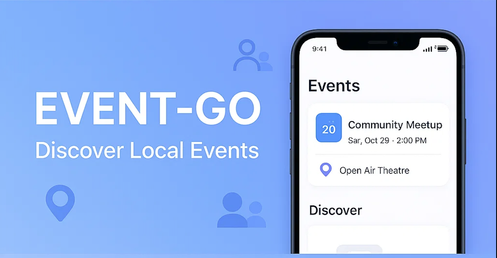
</h1>

<h1 align="center">
  <a href="#"> EVENT-GO </a>
</h1>

<p align="center">
  
 
  <a href="#">
    
  </a>
  
  <a href="https://github.com/atillaturker">
    
  </a>
</p>

<h4 align="center"> 
	Status: Finished
</h4>

<p align="center">
 <a href="#about">About</a> •
 <a href="#screenshots-demos">Screenshots & Demos</a> •
 <a href="#features">Features</a> •
 <a href="#tech-stack">Tech Stack</a> •  
 <a href="#setup-and-installation">How it works</a> • 
 <a href="#author">Author</a> 
</p>

## About

A mobile application built with **React Native (Expo)** that lets users discover, create, and manage local events. Users can explore nearby events via interactive maps, RSVP to events, and manage their participation. Organizers can create and manage their own events and handle attendance requests.

---

<h2 id="screenshots-demos">📸 Screenshots & Demos</h2>

<details>
  <summary><strong>📱 Click to view application screenshoots </strong></summary>
  <br>
  
  | User Screens | Organizer Screens | Common Screens|
  | :---: | :---: | :---: |
  | 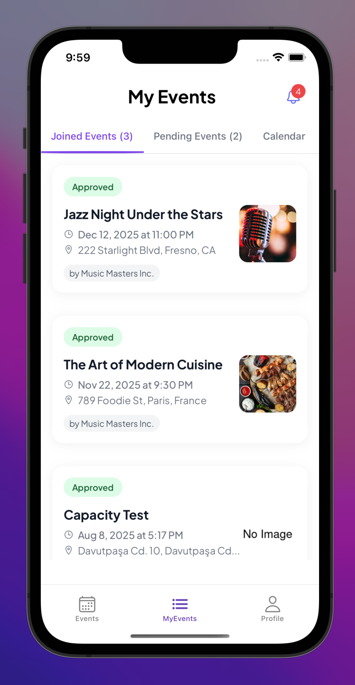 |  | 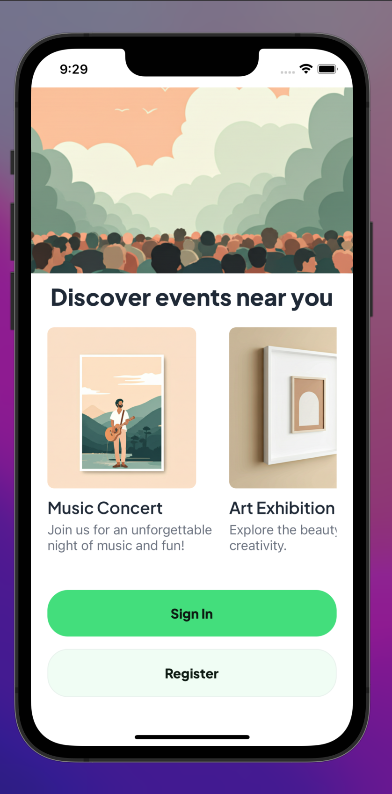 |
  | 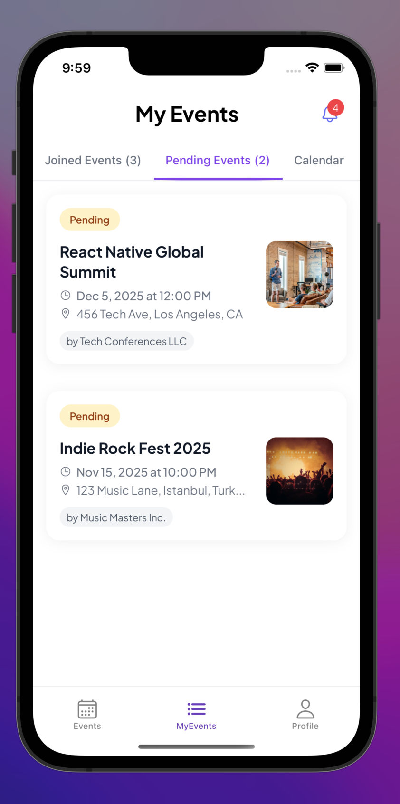 | 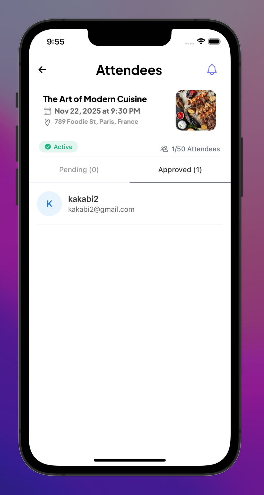 | 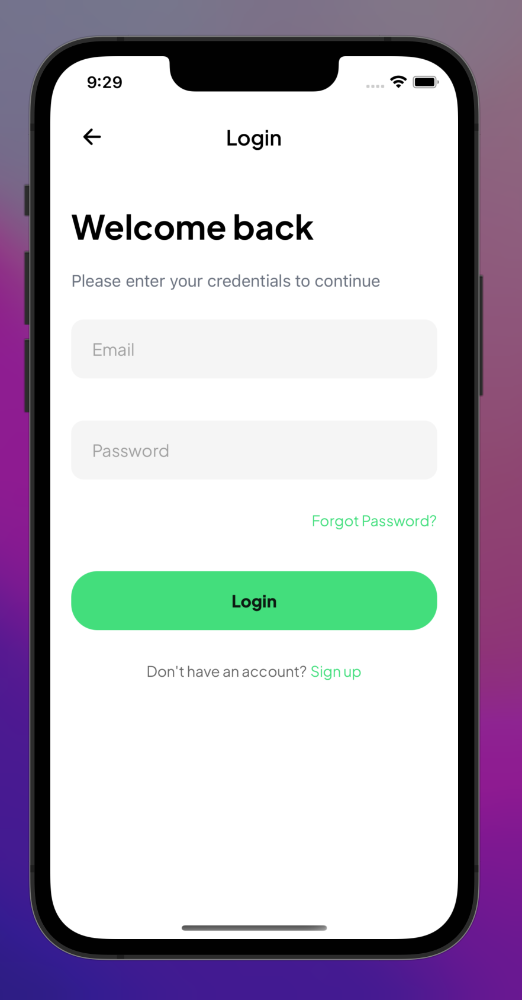 |
  | 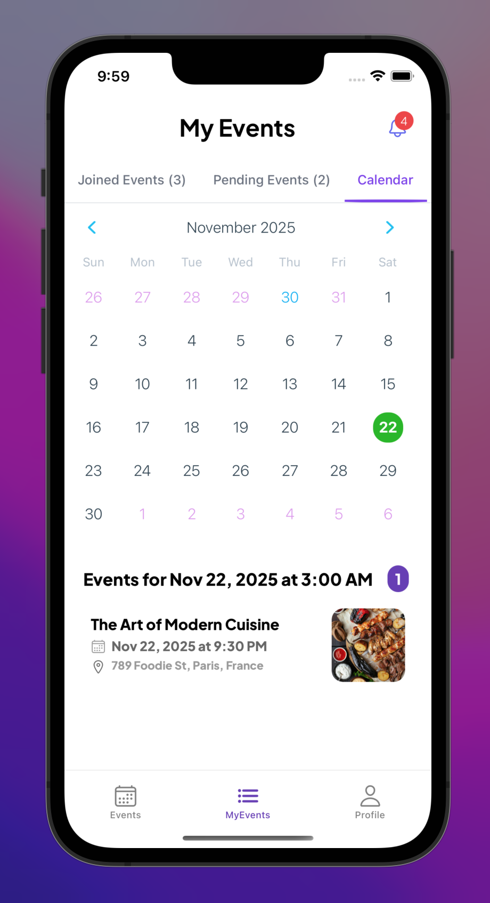 |  | 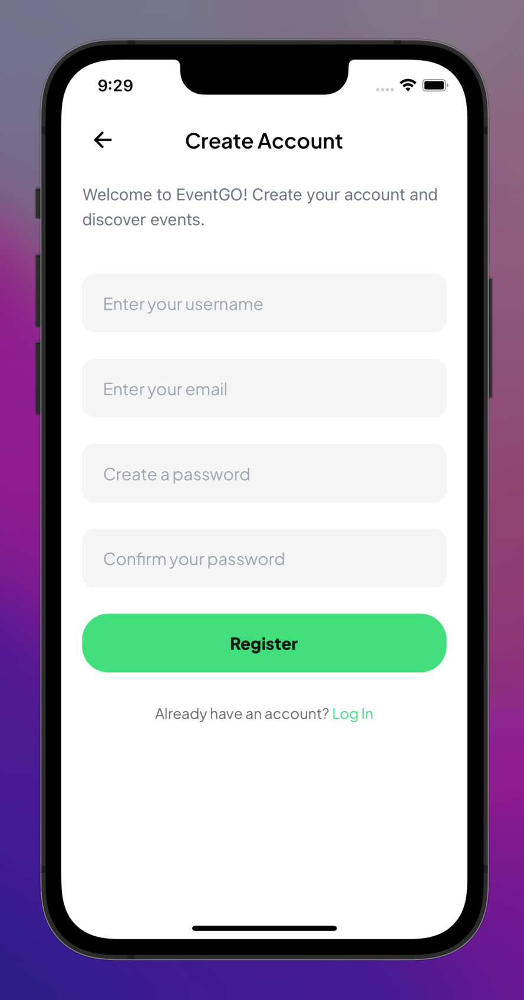 |
  | 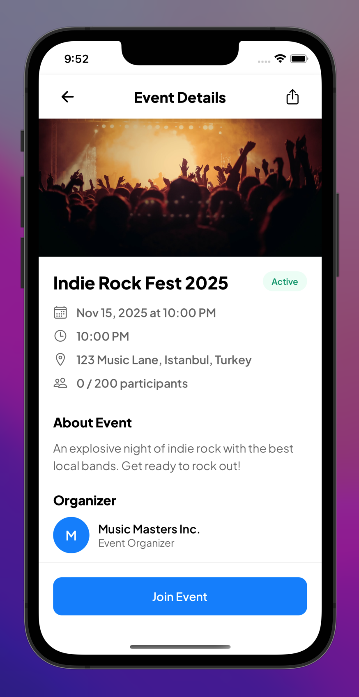 |  | 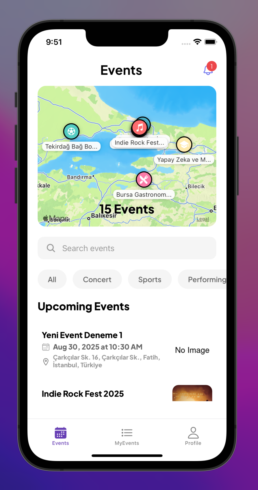 |
  | 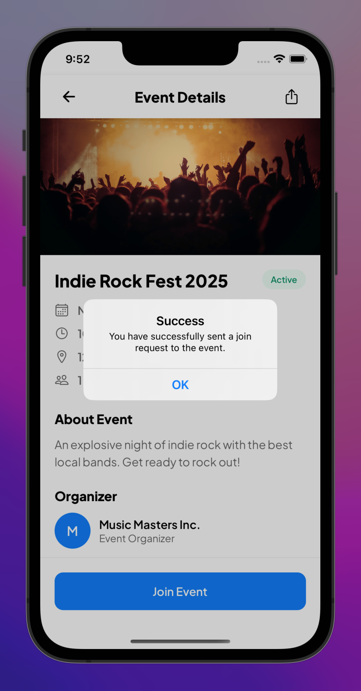 | 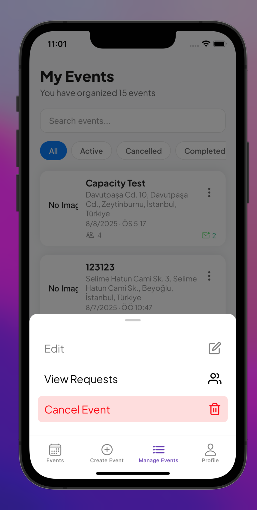 |  |
  | 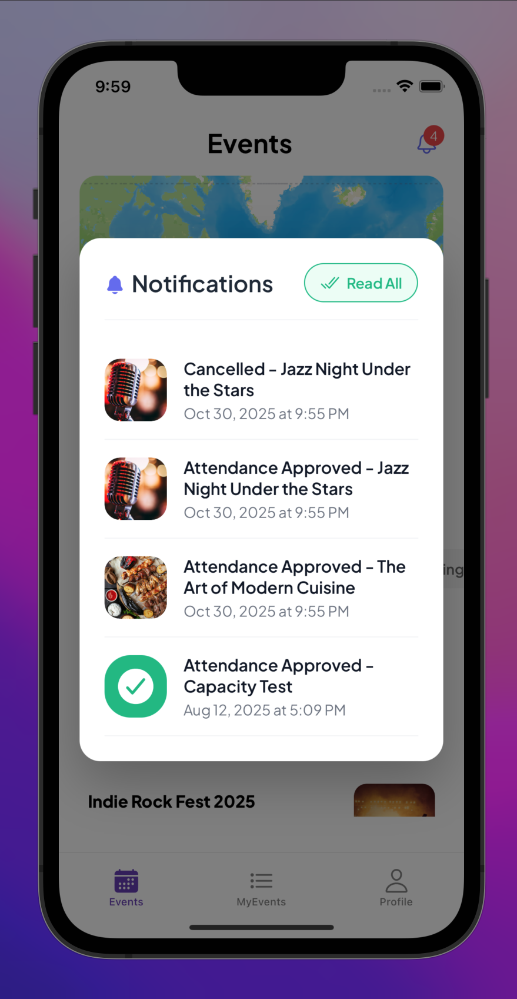 | 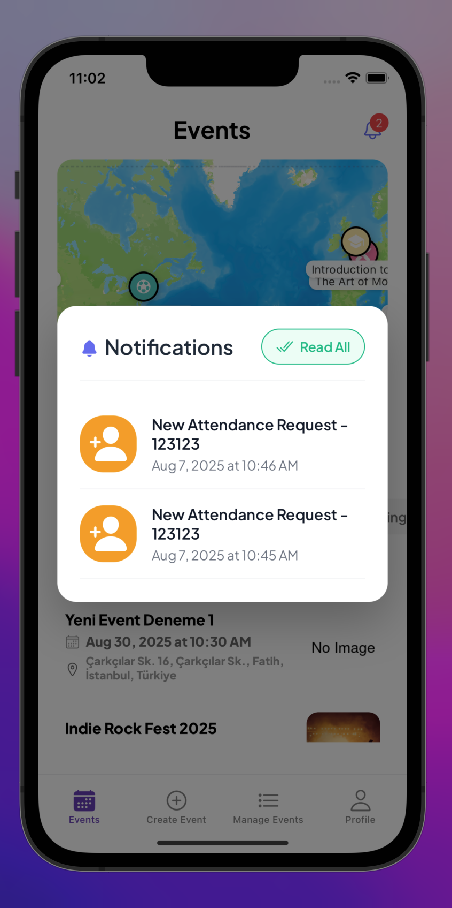 | 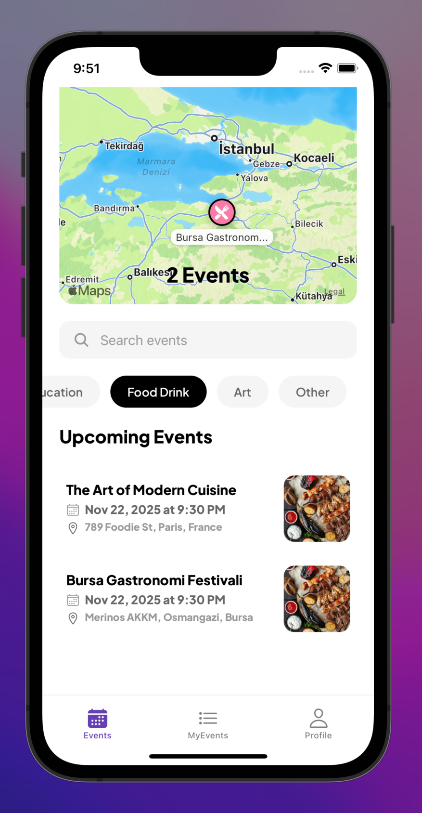 |

</details>

<details>
  <summary><strong>🎬 Click to see application GIFs</strong></summary>
  <br>
  
  
  <p align="center">
    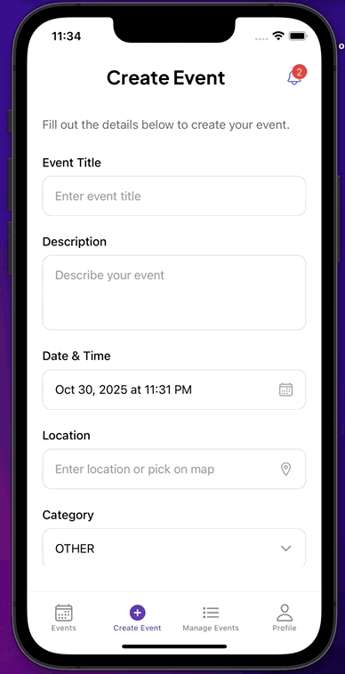
    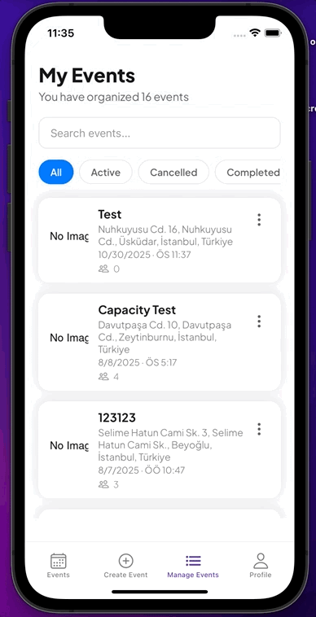
    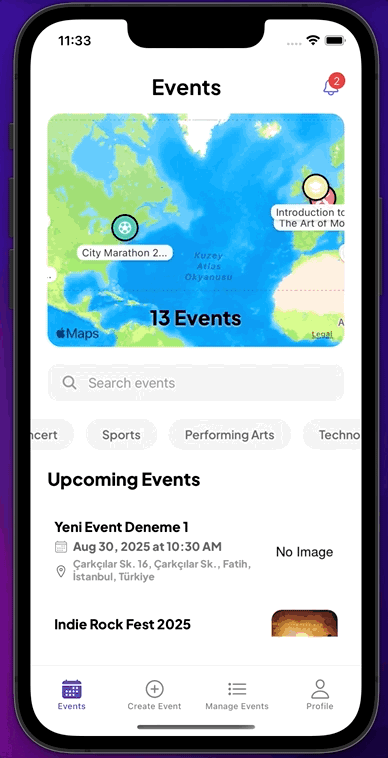
    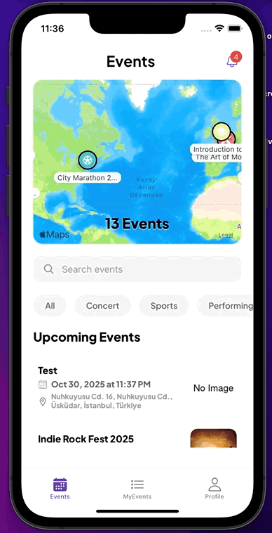
    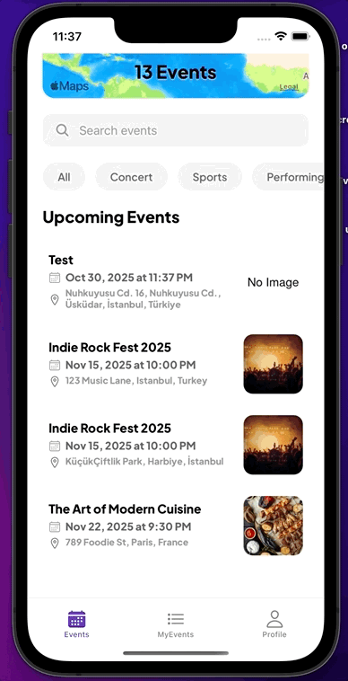
  </p>
</details>

<h2 id="features">🚀 Features</h2>  
- **🔍 Discover Events**: Discover nearby events on an interactive map and view detailed information (date, location, description, organizer).
- **🧾 Event Details**: View event details (date, location, description, organizer)
- **👩‍💼 Role-Based Access**: Separate functionalities for `USER` and `ORGANIZER` roles.
- **✨ Event Management**: Organizers can create, update, and cancel events.
- **📊 Attendance Management**: Organizers can manage attendance requests (approve/reject) for their events.
- **👤 User Authentication**: Secure login/register functionality using JWT.
- **🔔 Real-time Notifications**: Receive notifications for event updates, attendance requests, and approvals.
- **🪶 Modern UI**: A clean and modern user interface built with React Native.

<h2 id="tech-stack">🛠️ Tech Stack</h2>  
**Frontend:**
- React Native (Expo)
- **State Management:** Redux Toolkit & RTK Query
- **Navigation:** React Navigation
- **UI:** React Native components, `react-native-maps`

**Backend:**

- Node.js & Express
- **Database:** MongoDB with Prisma ORM
- **Authentication:** JWT (JSON Web Tokens)
- **APIs:** RESTful API for event data, authentication, and notifications.

<h2 id="setup-and-installation">⚙️ Setup and Installation</h2> 
The project is divided into two main parts: `EventGO App/` (the frontend) and `EventGO Backend/` (the backend).

### Backend Setup

1.  Navigate to the backend directory:
    ```sh
    cd "EventGO Backend"
    ```
2.  Install dependencies:
    ```sh
    npm install
    ```
3.  Create a `.env` file and configure your `DATABASE_URL` and `JWT_SECRET`.
4.  Generate the Prisma client:
    ```sh
    npx prisma generate
    ```
5.  Start the backend server:
    ```sh
    npm run dev
    ```

### Frontend Setup

1.  Navigate to the frontend directory:
    ```sh
    cd "EventGO App"
    ```
2.  Install dependencies:
    ```sh
    npm install
    ```
3.  Create a `.env` file and set the `EXPO_PUBLIC_API_URL` to your backend server's address (e.g., `http://<your-ip-address>:5000`).
4.  Start the Expo development server:
    ```sh
    npm start
    ```
5.  Scan the QR code with the Expo Go app on your mobile device.

## Author

[](https://www.linkedin.com/in/atillaturker/)
