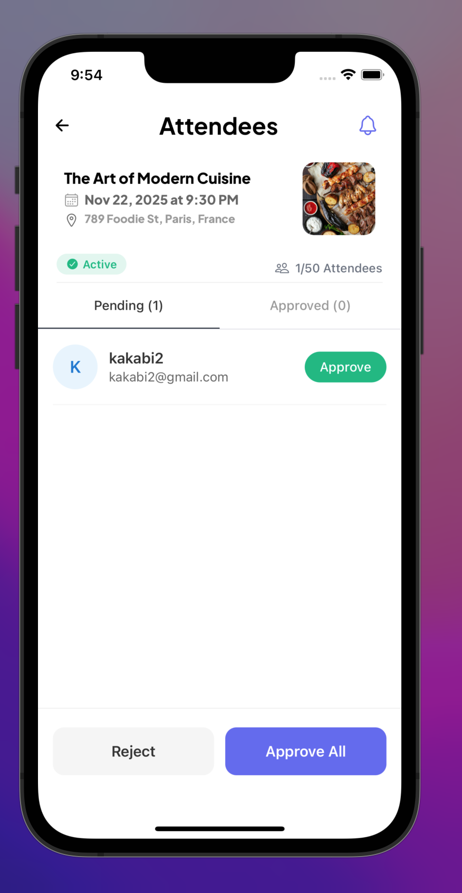
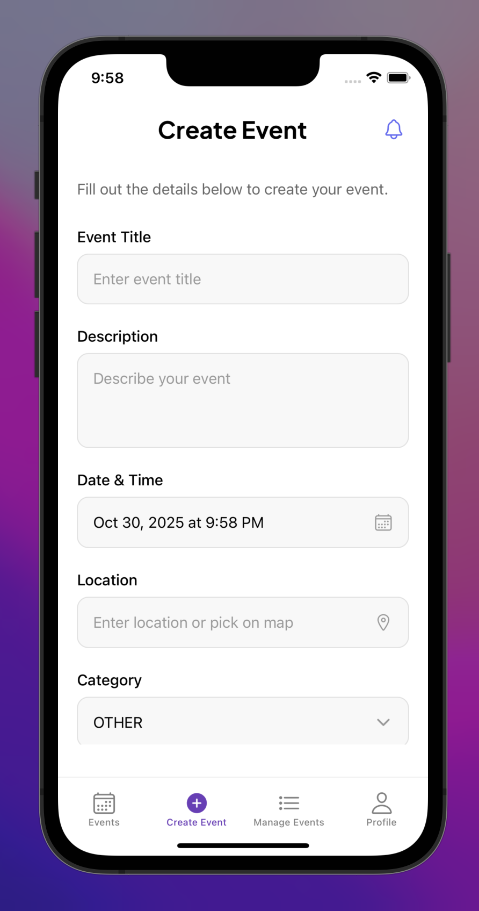
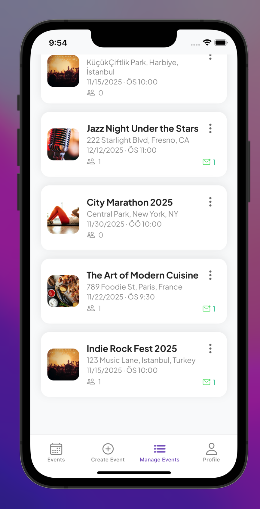
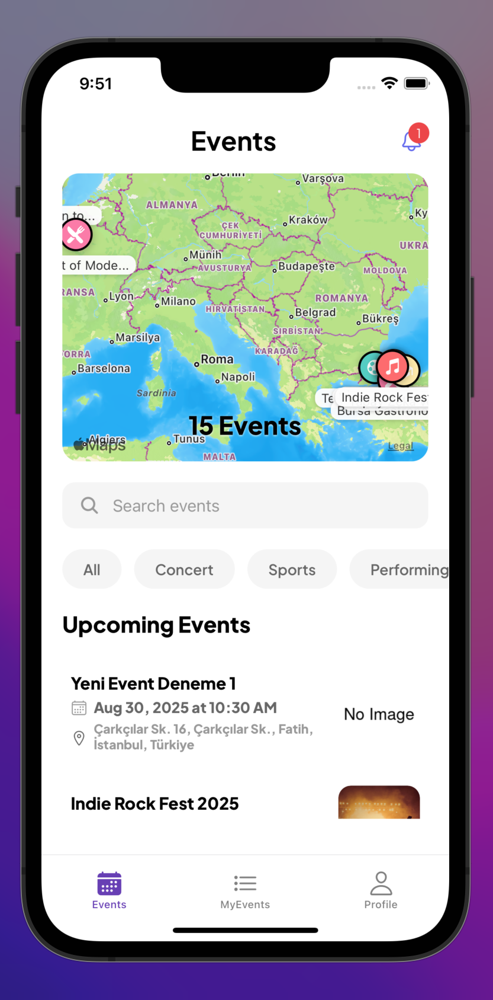

<h1 align="center">
    
</h1>

<h1 align="center">
  <a href="#"> EVENT-GO </a>
</h1>

<p align="center">
  
 
  <a href="#">
    
  </a>
  
  <a href="https://github.com/atillaturker">
    
  </a>
</p>

<h4 align="center"> 
  Status: Finished
</h4>

<p align="center">
 <a href="#about">About</a> •
 <a href="#screenshots-demos">Screenshots & Demos</a> •
 <a href="#features">Features</a> •
 <a href="#tech-stack">Tech Stack</a> •  
 <a href="#setup-and-installation">How it works</a> • 
 <a href="#author">Author</a> 
</p>

## About

📱 A mobile application built with **React Native (Expo)** that lets users 🌎 discover and 🎟️ register for local events — including 🎶 concerts, 🎭 theater performances, 🎓 seminars, 🏆 sporting events, and more — and easily manage their participation, all based on their 📍 location.

---

<h2 id="screenshots-demos">📸 Screenshots & Demos</h2>

<details>
  <summary><strong>📱 Click to view application screenshoots </strong></summary>
  <br>
  
  | User Screens | Organizer Screens | Common Screens|
  | :---: | :---: | :---: |
  |  |  |  |
  |  |  |  |
  |  |  |  |
  |  |  |  |
  |  |  |  |
  |  |  |  |

</details>

<details>
  <summary><strong>🎬 Click to see application GIFs</strong></summary>
  <br>
  
  
  <p align="center">
    
    
    
    
    
  </p>
</details>

<h2 id="features">🚀 Features</h2>

- **🔍 Discover Events**: Discover nearby events on an interactive map and view detailed information (date, location, description, organizer).
- **🧾 Event Details**: View event details (date, location, description, organizer)
- **👩‍💼 Role-Based Access**: Separate functionalities for `USER` and `ORGANIZER` roles.
- **✨ Event Management**: Organizers can create, update, and cancel events.
- **📊 Attendance Management**: Organizers can manage attendance requests (approve/reject) for their events.
- **👤 User Authentication**: Secure login/register functionality using JWT.
- **🔔 Real-time Notifications**: Receive notifications for event updates, attendance requests, and approvals.
- **🪶 Modern UI**: A clean and modern user interface built with React Native.

<h2 id="tech-stack">🛠️ Tech Stack</h2>

**Frontend:**

- **Core Framework**: React Native & Expo
- **Language**: TypeScript
- **State Management**:
  - **Redux Toolkit**: For managing global application state, particularly user authentication.
  - **RTK Query**: For efficient data fetching, caching, and managing server state.
- **Navigation**:
  - **React Navigation**: For handling navigation between screens, including stack and bottom tab navigators.
- **UI & Components**:
  - **React Native Components**: Core UI elements.
  - **`react-native-maps`**: To display interactive maps for event locations.
  - **`react-native-calendars`**: For the calendar view in the "My Events" section.
  - **`@gorhom/bottom-sheet`**: For creating interactive bottom sheet menus.
  - **`@expo/vector-icons`**: For a rich set of icons used throughout the app.
- **Forms**:
  - **React Hook Form**: For robust and performant form state management.
  - **Zod**: For schema-based form validation.
- **Authentication & Storage**:
  - **`expo-secure-store`**: For securely storing the JWT authentication token on the device.
  - **`jwt-decode`**: For decoding JWT tokens on the client side.
- **Fonts**:
  - **`@expo-google-fonts/plus-jakarta-sans`**: For custom font styling.

### Backend

- **Core Framework**: Node.js & Express.js
- **Language**: TypeScript
- **Database & ORM**:
  - **MongoDB**: As the primary NoSQL database.
  - **Prisma**: As the ORM for type-safe database access and schema management.
- **Authentication**:
  - **JSON Web Tokens (JWT)**: For securing API endpoints and managing user sessions.
  - **`bcryptjs`**: For hashing user passwords before storing them.
- **API**:
  - **RESTful API**: Architecture for client-server communication.
- **Scheduled Jobs**:
  - **`node-cron`**: For running scheduled tasks, such as updating event statuses.
- **Middleware**:
  - **`cors`**: To enable Cross-Origin Resource Sharing.
  - Custom middleware for token authentication and role-based access control (`USER` vs. `ORGANIZER`).

<h2 id="setup-and-installation">⚙️ Setup and Installation</h2>

The project is divided into two main parts: `EventGO App/` (the frontend) and `EventGO Backend/` (the backend).

### Backend Setup

1.  Navigate to the backend directory:
    ```sh
    cd "EventGO Backend"
    ```
2.  Install dependencies:
    ```sh
    npm install
    ```
3.  Create a `.env` file and configure your `DATABASE_URL` and `JWT_SECRET`.
4.  Generate the Prisma client:
    ```sh
    npx prisma generate
    ```
5.  Start the backend server:
    ```sh
    npm run dev
    ```

### Frontend Setup

1.  Navigate to the frontend directory:
    ```sh
    cd "EventGO App"
    ```
2.  Install dependencies:
    ```sh
    npm install
    ```
3.  Create a `.env` file and set the `EXPO_PUBLIC_API_URL` to your backend server's address (e.g., `http://<your-ip-address>:5000`).
4.  Start the Expo development server:
    ```sh
    npm start
    ```
5.  Scan the QR code with the Expo Go app on your mobile device.

## Author

[](https://www.linkedin.com/in/atillaturker/)
